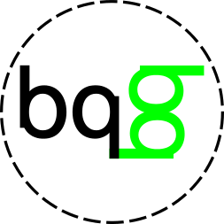
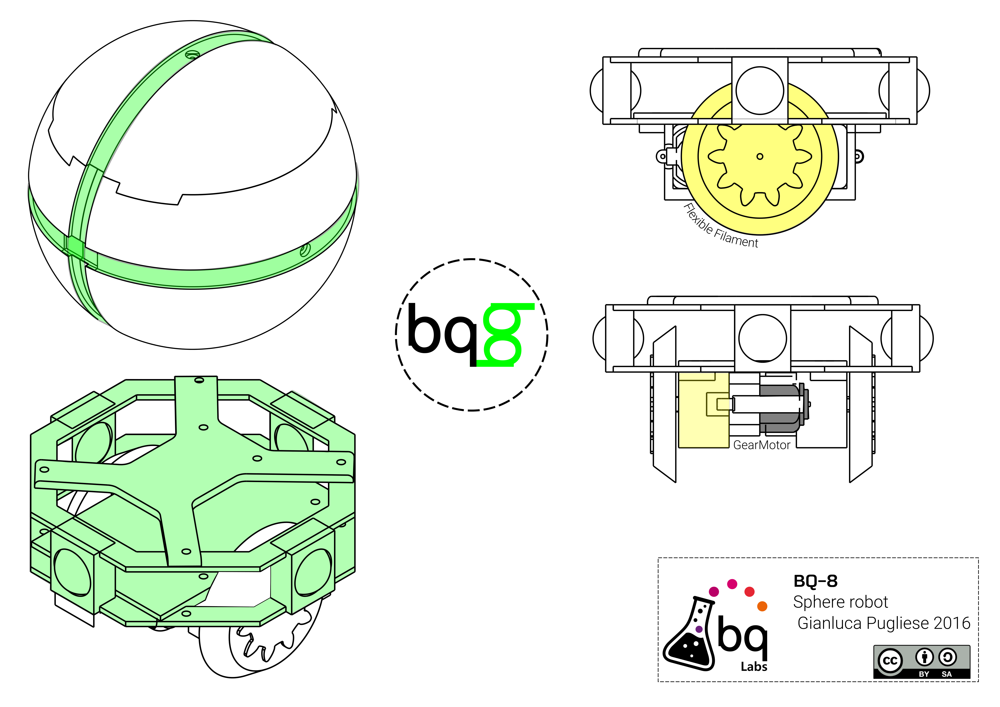

<table>
<tr>
<td>

</td>
</tr>
</table>

# BQ-8 

Robot inspired on Sphero

## BOM
- 2 Geared motor DG02S [like this](http://www.robotshop.com/en/dagu-gear-motor-pair-offset-shaft.html)
- [OmniBoard](https://github.com/bqlabs/OmniBoard) or ESP motor board
- 1 one cell Battery
- 3D printed parts
- [AirPad](https://github.com/bqlabs/AirPad) app for Android

## Files
At the moment Version v05 work well

Load **BQ-8_Sphere_v05.stl** in Cura and split into objects, then print with 2mm perimeters and Touching Buildplate supports

## Contributing
1. Fork it!
2. Create your feature branch: `git checkout -b my-new-feature`
3. Commit your changes: `git commit -am 'Add some feature'`
4. Push to the branch: `git push origin my-new-feature`
5. Submit a pull request :D

## Credits

[Alvaro Ferrán](https://github.com/alvaroferran) for the OmniBoard

Designed by Gianluca Pugliese [Owensource](https://www.owensource.com) 

Sponsored by BQ untill March 2016

## License

This robot is licensed under a [Creative Commons Attribution-ShareAlike 4.0 International License](http://creativecommons.org/licenses/by-sa/4.0/). Please read the LICENSE files for more details.

Este robot tiene una licencia [Creative Commons Attribution-ShareAlike 4.0 International License](http://creativecommons.org/licenses/by-sa/4.0/). Por favor, lea los ficheros LICENSE para más detalles
